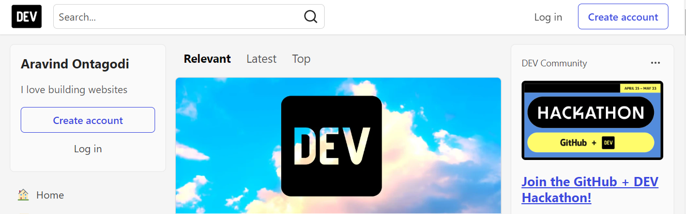

# DOM Assignments

## 1. Webiste Name: [Dev To](https://dev.to/)

### Topics

> Query Selctor, Inner HTML

```JS
let card = document.querySelector("aside > .crayons-card");

card.querySelector("h2").innerHTML = "Aravind Ontagodi";

card.querySelector("p").innerHTML = "I love building websites";
```



